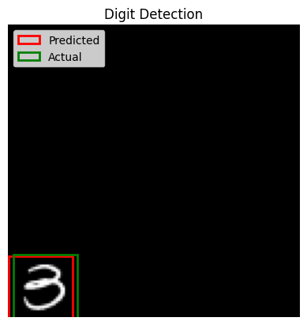
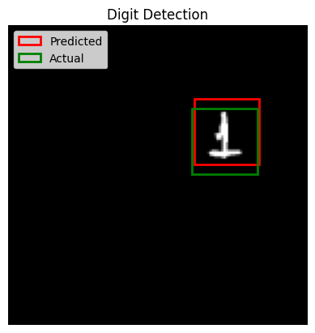
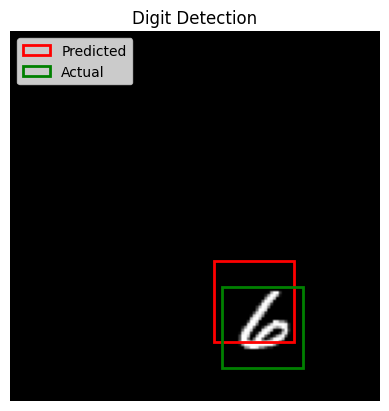
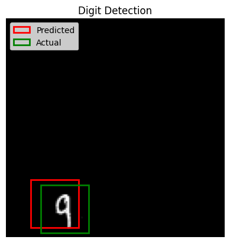
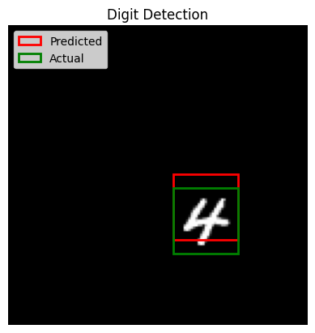

# Object Detection from Scratch using TensorFlow

A complete end-to-end object detection pipeline built from scratch — from synthetic dataset generation to bounding box prediction and digit classification — using TensorFlow and classical computer vision techniques. This branch (`pipeline`) integrates **CNN bbox detection, classical fallback, and digit classification** into a single unified pipeline.

## 📋 Table of Contents
1. [Overview](#overview)
2. [Architecture](#architecture)
3. [What's New in Pipeline](#whats-new-in-pipeline)
4. [File Structure](#file-structure)
5. [Getting Started](#getting-started)
6. [Usage](#usage)
7. [Results](#results)
8. [Branches](#branches)
9. [Contributing](#contributing)
10. [Author](#author)

---

## 🔍 Overview

This project implements an object detection system trained on synthetic data derived from MNIST digits. The full pipeline:

1. **Localizes** the digit by predicting a bounding box (CNN regression + classical fallback)
2. **Classifies** the detected digit (0–9)

The CNN handles most predictions, and a connected-component fallback catches edge cases where the CNN fails — making the system robust in production-like scenarios.

---

## 🏗️ Architecture

The `DigitDetectionPipeline` runs in three stages:

```
Input Image (128×128)
        │
        ▼
┌──────────────────┐
│  Bbox Detection   │
│  (CNN Regression) │──── Predict [x_min, y_min, x_max, y_max]
└────────┬─────────┘
         │
         │ Invalid bbox?
         ▼
┌──────────────────┐
│ Classical Fallback│
│ (Connected Comp.) │──── Binary threshold → largest component → bbox
└────────┬─────────┘
         │
         ▼
┌──────────────────┐
│   Crop & Resize   │──── Extract digit region → resize to 28×28
└────────┬─────────┘
         │
         ▼
┌──────────────────┐
│ Digit Classifier  │──── CNN classifier → digit (0-9) + confidence
└──────────────────┘
```

**Key design decisions:**
- **Fallback strategy**: If the CNN bbox prediction is invalid (NaN, negative area, out of bounds, or >90% of image), the system automatically falls back to classical connected-component analysis
- **Batch prediction**: `predict_batch()` efficiently processes multiple images with batched model calls instead of per-image inference
- **Experiment logging**: Built-in JSON logging tracks predictions, bbox sources (CNN vs classical), and confidence scores

---

## 🆕 What's New in Pipeline

- **`digit_detector.py`** — `DigitDetectionPipeline` class combining:
  - CNN bbox regression with automatic validation
  - Classical fallback (connected components) when CNN fails
  - Digit classification after cropping
  - Single-image `predict()` and efficient `predict_batch()` methods
  - JSON experiment logging
- **`eval_fallbacks.py`** — `Evaluator` class for analyzing CNN vs classical fallback performance:
  - Compare IoU accuracy between both methods  
  - Track how often each method is used

---

## 📂 File Structure

```
root/
├── GenerateDataset.py              # Synthetic dataset generator (MNIST → 128×128 canvas)
│
├── ObjectDetect.ipynb              # Base model training & evaluation
├── ObjectDetect_Performance.ipynb  # Performance-tuned model (v3)
│
├── digit_detector.py               # DigitDetectionPipeline: full detect + classify pipeline
├── bbox_detector.py                # BboxDetector: classical connected-component detector
├── evaluate_bbox.py                # Bbox evaluation metrics (IoU, MAE, MSE, RMSE)
├── eval_fallbacks.py               # CNN vs Classical fallback analysis
│
├── utils/
│   ├── __init__.py
│   ├── reader.py                   # FileReader: image/label file I/O
│   ├── visualizer.py               # Visualizer: bbox overlay visualization
│   └── dataset.py                  # DatasetBuilder: TF tensor dataset loader
│
├── result/                         # Prediction visualizations and training curves
├── requirements.txt
├── .gitignore
└── README.md
```

---

## 🚀 Getting Started

### Prerequisites
- Python 3.8+
- TensorFlow 2.10+
- CUDA-compatible GPU (recommended for training)

### Installation

1. **Clone the repository:**
   ```bash
   git clone -b pipeline https://github.com/Asmit-Kumar/Object-Detection-from-Scratch-using-tensorflow.git
   cd Object-Detection-from-Scratch-using-tensorflow
   ```

2. **Create a virtual environment (recommended):**
   ```bash
   python -m venv .venv
   .venv\Scripts\activate    # Windows
   source .venv/bin/activate  # Linux/Mac
   ```

3. **Install dependencies:**
   ```bash
   pip install -r requirements.txt
   ```

---

## 💻 Usage

### Dataset Generation

```bash
python GenerateDataset.py
```

### Training

| Notebook | Purpose |
|----------|---------|
| `ObjectDetect.ipynb` | Base model — initial CNN architecture |
| `ObjectDetect_Performance.ipynb` | Performance model — improved architecture |

### Running the Detection Pipeline

After training, run the full pipeline (bbox detection + digit classification):

```bash
python digit_detector.py
```

**Using the pipeline in code:**

```python
from digit_detector import DigitDetectionPipeline
import tensorflow as tf

bbox_model = tf.keras.models.load_model("bbox_model.keras")
classifier_model = tf.keras.models.load_model("Models/DigitRecog.h5")

pipeline = DigitDetectionPipeline(
    bbox_model=bbox_model,
    classifier_model=classifier_model,
    normalize_bbox=True
)

# Single image prediction
result = pipeline.predict(image)
# → {"bbox": [x_min, y_min, x_max, y_max], "digit": 7, "confidence": 0.98}

# Batch prediction (efficient)
results = pipeline.predict_batch(images_batch, batch_size=32)
```

### Evaluation

**Bbox evaluation:**
```bash
python evaluate_bbox.py
```

**CNN vs Fallback analysis:**
```bash
python eval_fallbacks.py
```

---

## 📊 Results

### Training Curves (Performance Model)


### Prediction Visualizations

Bounding box predictions — Green: Ground Truth | Red: Predicted:


### Base Model Predictions

| Image | Visualization |
|-------|---------------|
| `result/1.png` |  |
| `result/2.png` |  |
| `result/3.png` |  |
| `result/4.png` |  |
| `result/5.png` |  |

---

## 🌿 Branches

| Branch | Description |
|--------|-------------|
| `main` | Base object detection — dataset generation, CNN bbox model, classical fallback, evaluation |
| `v3` | Performance-tuned model — improved architecture and training |
| **`pipeline`** | **← You are here** — Full detection pipeline with CNN + fallback + digit classification |

---

## Contributing

Contributions are welcome!  
Fork the repository, create a branch, and submit a pull request.

---

## 👤 Author

- **Asmit Kumar** — [GitHub](https://github.com/Asmit-Kumar)
