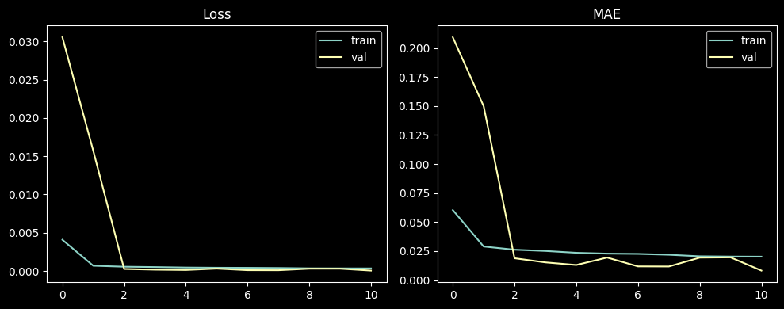
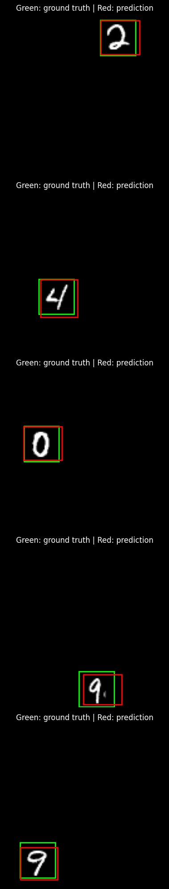
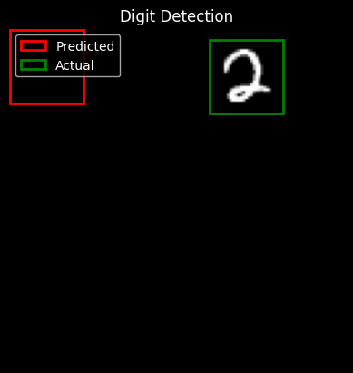
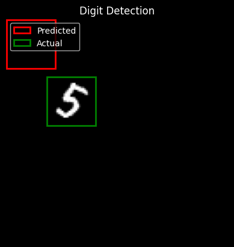
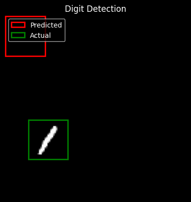
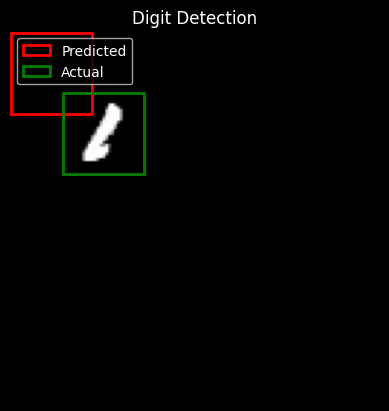
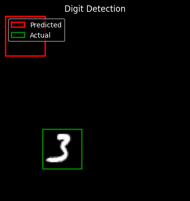

# Object Detection from Scratch using TensorFlow

A custom object detection system built entirely from scratch — from synthetic dataset generation to bounding box prediction — using TensorFlow and classical computer vision techniques. This branch (`v3`) introduces a **performance-tuned model** with an improved architecture and training strategy.

## 📋 Table of Contents
1. [Overview](#overview)
2. [What's New in v3](#whats-new-in-v3)
3. [Features](#features)
4. [File Structure](#file-structure)
5. [Getting Started](#getting-started)
6. [Usage](#usage)
7. [Results](#results)
8. [Branches](#branches)
9. [Contributing](#contributing)
10. [Author](#author)

---

## 🔍 Overview

This project generates synthetic training data from MNIST digits and trains a deep learning model to predict bounding boxes for the digits within 128×128 canvas images. It combines a CNN-based bounding box regression model with a classical connected-component fallback for robust detection.

---

## 🆕 What's New in v3

- **`ObjectDetect_Performance.ipynb`** — A performance-tuned model with:
  - Improved CNN architecture for better bbox regression
  - Optimized training strategy (learning rate, epochs, callbacks)
  - Built using `utils/dataset.py` for cleaner data loading
- **`utils/dataset.py`** — `DatasetBuilder` class for loading bbox and classification datasets as TensorFlow tensors
- **Training Curves** — Visualized model convergence:

  

- **Improved Predictions** — Tighter bbox predictions (Green: Ground Truth, Red: Predicted):

  

---

## ✨ Features

- **Synthetic Dataset Generator** — Converts MNIST digits (28×28) into 128×128 canvas images with random placement
- **CNN Bounding Box Model** — Deep learning regression model for bounding box prediction
- **Performance-Tuned Model** *(v3)* — Improved architecture with better convergence
- **Classical Fallback Detector** — Connected-component analysis (scipy) as robust backup
- **Dataset Builder Utility** *(v3)* — Clean TF tensor dataset loading for bbox and classification data
- **Evaluation Metrics** — IoU, MAE, MSE for measuring detection accuracy
- **Visualization** — Tools to overlay predicted vs actual bounding boxes

---

## 📂 File Structure

```
root/
├── GenerateDataset.py              # Synthetic dataset generator (MNIST → 128×128 canvas)
├── ObjectDetect.ipynb              # Base model training & evaluation
├── ObjectDetect_Performance.ipynb  # Performance-tuned model (v3)
├── bbox_detector.py                # BboxDetector: classical connected-component detector
├── evaluate_bbox.py                # Bbox evaluation metrics (IoU, MAE, MSE, RMSE)
├── utils/
│   ├── __init__.py
│   ├── reader.py                   # FileReader: image/label file I/O
│   ├── visualizer.py               # Visualizer: bbox overlay visualization
│   └── dataset.py                  # DatasetBuilder: TF tensor dataset loader (v3)
├── result/                         # Prediction visualizations and training curves
├── requirements.txt
├── .gitignore
└── README.md
```

---

## 🚀 Getting Started

### Prerequisites
- Python 3.8+
- TensorFlow 2.10+
- CUDA-compatible GPU (recommended for training)

### Installation

1. **Clone the repository:**
   ```bash
   git clone -b v3 https://github.com/Asmit-Kumar/Object-Detection-from-Scratch-using-tensorflow.git
   cd Object-Detection-from-Scratch-using-tensorflow
   ```

2. **Create a virtual environment (recommended):**
   ```bash
   python -m venv .venv
   .venv\Scripts\activate    # Windows
   source .venv/bin/activate  # Linux/Mac
   ```

3. **Install dependencies:**
   ```bash
   pip install -r requirements.txt
   ```

---

## 💻 Usage

### Dataset Generation

Place the MNIST CSV file (`train.csv`) in the `csvs/` directory, then run:

```bash
python GenerateDataset.py
```

### Training

| Notebook | Purpose |
|----------|---------|
| `ObjectDetect.ipynb` | Base model — initial CNN architecture and training |
| `ObjectDetect_Performance.ipynb` | **Performance model** — improved architecture, better training strategy |

### Evaluation

```bash
python evaluate_bbox.py
```

Outputs: MAE, MSE, RMSE, Mean IoU, IoU@0.50, IoU@0.75.

---

## 📊 Results

### Training Curves (Performance Model)


### Prediction Visualizations

Bounding box predictions — Green: Ground Truth | Red: Predicted:


### Base Model Predictions

| | | |
|:---:|:---:|:---:|
|  |  |  |
|  |  | |

---

## 🌿 Branches

| Branch | Description |
|--------|-------------|
| `main` | Base object detection — dataset generation, CNN bbox model, classical fallback, evaluation |
| **`v3`** | **← You are here** — Performance-tuned model with improved architecture and training |
| `pipeline` | Full detection pipeline — integrates bbox detection (CNN + fallback) with digit classification |

---

## Contributing

Contributions are welcome!  
Fork the repository, create a branch, and submit a pull request.

---

## 👤 Author

- **Asmit Kumar** — [GitHub](https://github.com/Asmit-Kumar)
