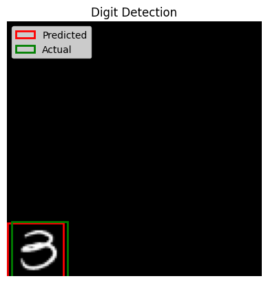

# Object-Detection-from-Scratch-using-tensorflow

This project demonstrates an end-to-end solution for generating a custom object detection dataset using the MNIST digits dataset and training a deep learning model to predict bounding boxes for the digits in 128x128 canvas images. The results of the predictions are stored in the `result/` directory.

---

## Table of Contents
1. [Overview](#overview)
2. [Features](#features)
3. [File Structure](#file-structure)
4. [Getting Started](#getting-started)
   - [Prerequisites](#prerequisites)
   - [Setup](#setup)
5. [Usage](#usage)
   - [Dataset Generation](#dataset-generation)
   - [Training and Testing the Model](#training-and-testing-the-model)
   - [Viewing Results](#viewing-results)
6. [Results](#results)
   - [Training Metrics](#training-metrics)
   - [Result Visuals](#result-visuals)
7. [Contributing](#contributing)
8. [License](#license)
9. [Author](#author)

---

## Overview

This project involves generating images derived from MNIST digits and training a deep learning model to predict bounding boxes for the digits within those images.  
It provides a practical demonstration of dataset preparation, deep learning model training, and visualization of results.

---

## Features

- **Custom Dataset Generator**:
  - Converts MNIST digit images (28x28) into 128x128 canvas images.
  - Places the digit randomly within the canvas.
  - Automatically generates bounding box labels.
- **Object Detection Model**:
  - Deep learning model predicts bounding boxes for digits.
  - Trains on the generated dataset using TensorFlow/Keras.
- **Result Visualization**:
  - Saves predicted bounding box results as images in the `result/` directory.
  - Example result images: `result/1.png`, `result/2.png`, etc.

---

## File Structure

```
root/
├── GenerateDataset.py   # Dataset generation script
├── ObjectDetect.ipynb   # Jupyter Notebook for model training and evaluation
├── Images/              # Generated images (from dataset generation script)
├── label/               # Bounding box labels
├── result/              # Prediction result images (e.g., 1.png, 2.png, ...)
├── train.csv            # MNIST dataset (required as input)
├── requirements.txt     # Dependencies
└── README.md            # This file
```

---

## Getting Started

### Prerequisites
Ensure you have the following installed:
- Python 3.8 or higher
- Libraries:
  - `pandas`
  - `numpy`
  - `matplotlib`
  - `tensorflow`

### Setup
1. Clone the repository:
   ```bash
   git clone <https://github.com/Asmit-Kumar/Object-Detection-from-Scratch-using-tensorflow>
   cd <repository-folder>
   ```
2. Install dependencies:
   ```bash
   pip install -r requirements.txt
   ```

---

## Usage

### Dataset Generation
1. Place the MNIST dataset (`train.csv`) in the repository root directory.
2. Run the `GenerateDataset.py` script:
   ```bash
   python GenerateDataset.py
   ```
3. The generated images will be saved in the `Images/` directory, and corresponding bounding box labels will be stored in the `label/` directory.

### Training and Testing the Model
1. Open `ObjectDetect.ipynb` in Jupyter Notebook.
2. Follow the steps in the notebook to:
   - Load the generated dataset.
   - Define the deep learning model architecture.
   - Train the model.
   - Evaluate the model's performance.

### Viewing Results
- After training and testing, the model's predictions are visualized and saved in the `result/` directory.
- Example result images include:
  - `result/1.png`
  - `result/2.png`
  - ...

---

## Results

### Training Metrics
The training and validation performance are measured using the following metrics:
- Loss (Mean Squared Error)
- Mean Squared Error (MSE)

Plots for training and validation metrics:

| Metric                   | Plot                                                                 |
|--------------------------|----------------------------------------------------------------------|
| Loss                     |                                   |
| Mean Squared Error (MSE) |                                     |

### Result Visuals
Here are sample predictions visualized in the `result/` directory:

| Image                  | Visualization                      |
|------------------------|-------------------------------------|
| `result/1.png`         |              |
| `result/2.png`         |              |
| `result/3.png`         |              |
| `result/4.png`         |              |
| `result/5.png`         |              |

---

## Contributing

Contributions are welcome!  
If you have suggestions for improvement or want to fix any issues, feel free to fork the repository, create a branch, and submit a pull request.

---

## Author

- **Asmit Kumar**  
  - GitHub: [Asmit-Kumar](https://github.com/Asmit-Kumar)

---
